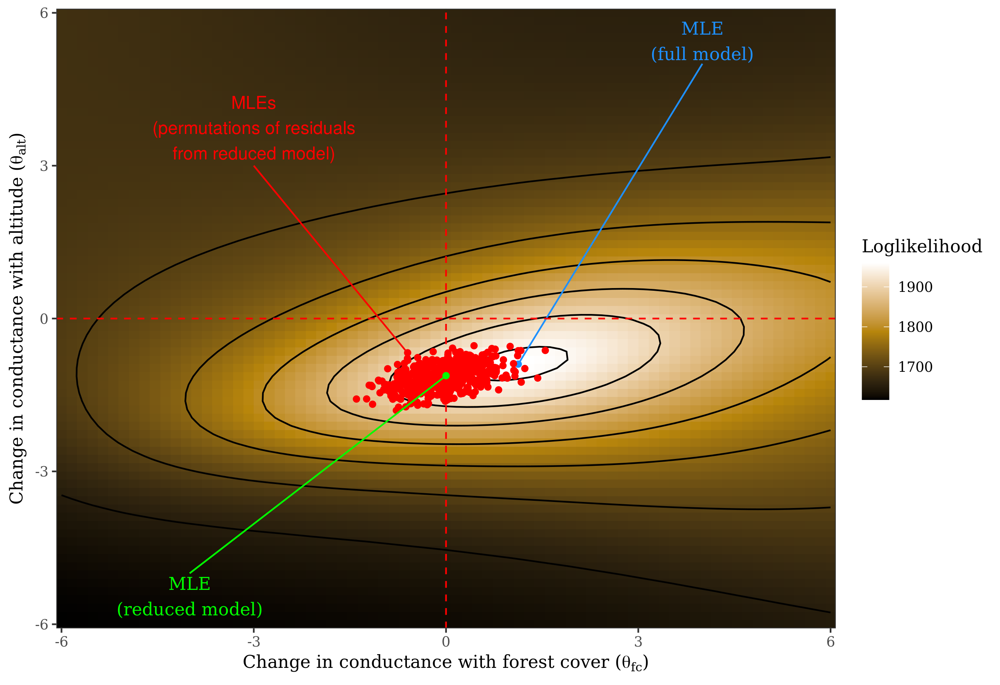

# radish

Fast gradient-based optimization of resistance surfaces.

`radish` is an R package for maximum likelihood estimation of isolation-by-resistance models, where conductance is a function of spatial covariates, the observed data are genetic distances, and the likelihood of the "measurement process" is cheap to compute (e.g. regression of distance matrices, or generalized Wishart). It also provides fast computation of the gradient, Hessian matrix, and derivative-based leverage/influence measures. As currently implemented it is intended for moderate-sized problems (e.g. rasters with less than 1mil cells, where a sparse Choleski decomposition is feasible).



Requires [corMLPE](https://github.com/nspope/corMLPE): `devtools::install_github("nspope/corMLPE")`. Other dependencies are available through CRAN. Install `radish` via `devtools::install_github("nspope/radish")`.

This is a work-in-progress and the interface/methods may change without notice. Contact at nspope at utexas dot edu.

# Minimal example

```r
library(radish)
library(raster)

data(melip)

covariates <- raster::stack(melip.altitude, melip.forestcover)

# currently, it's crucial to scale variables
scale_to_0_1 <- function(x) (x - min(x, na.rm = TRUE))/(max(x, na.rm = TRUE) - min(x, na.rm = TRUE))
values(melip.altitude) <- scale_to_0_1(values(melip.altitude))
values(melip.forestcover) <- scale_to_0_1(values(melip.forestcover))

covariates <- raster::stack(list(altitude=melip.altitude, forestcover=melip.forestcover))

plot(covariates[["altitude"]])
points(melip.coords)

surface <- radish_conductance_surface(covariates, melip.coords, directions = 8)
fit_mlpe <- radish(radish::loglinear_conductance, radish::mlpe, surface, melip.Fst)

summary(fit_mlpe)

plot(fitted(fit_mlpe, "distance"), melip.Fst, pch = 19,
     xlab = "Optimized resistance distance", ylab = "Fst")

# visualise likelihood surface across grid (takes awhile)
theta <- as.matrix(expand.grid(x=seq(-6,6,length.out=21), y=seq(-6,6,length.out=21)))
grid <- radish_grid(loglinear_conductance, mlpe, surface, melip.Fst, theta, covariance=FALSE)

library(ggplot2)
ggplot(data.frame(loglik=grid$loglik, grid$theta)) + 
  geom_tile(aes(x=x,y=y,fill=-loglik)) + theme_bw() +
  geom_contour(aes(x=x,y=y,z=-loglik), color="black") +
  xlab(expression(theta[altitude])) +
  ylab(expression(theta[forestcover]))

# calculate resistance distances across grid
distances <- radish_distance(loglinear_conductance, surface, theta)

ibd <- which(theta[,1] == 0 & theta[,2] == 0)
plot(distances$distance[,,ibd], melip.Fst, pch = 19, 
     xlab = "Null resistance distance (IBD)", ylab = "Fst")

# compute negative loglikelihood, gradient, Hessian for a given choice of
# of the conductance parameters theta, using a different measurement model
# (radish::generalized_wishart)
radish_algorithm(radish::loglinear_conductance, radish::generalized_wishart, surface, 
                 ifelse(melip.Fst < 0, 0, melip.Fst), nu = 1000, theta = c(-0.3, 0.3), 
                 gradient = TRUE, hessian = TRUE)$hessian
# numerical verification (not run)
#numDeriv::hessian(function(x)
#     radish_algorithm(radish::loglinear_conductance, radish::generalized_wishart, surface, 
#                      ifelse(melip.Fst < 0, 0, melip.Fst), nu = 1000, theta = x,
#                      gradient = TRUE, hessian = TRUE)$objective,
#               c(-0.3, 0.3))
```
 
# RStan hooks
In progress
